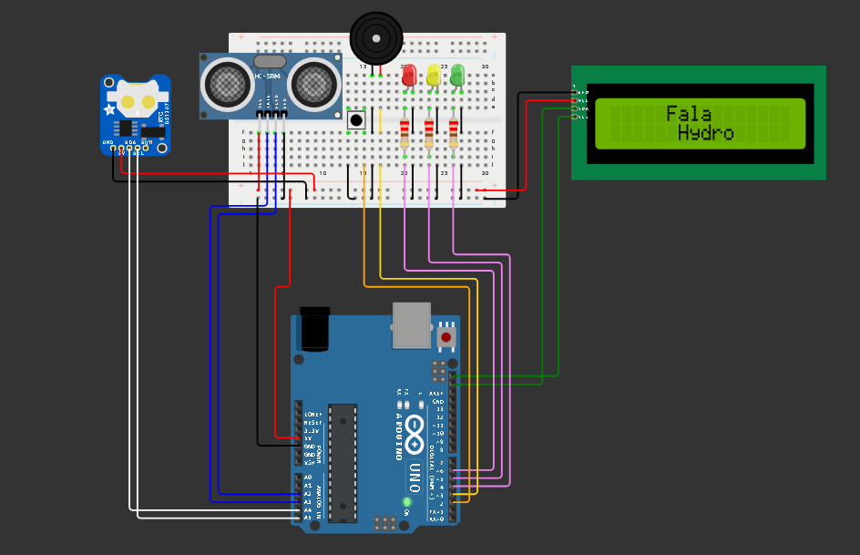

# 🌊 FalaHydro - Sistema Físico de Monitoramento de Enchentes

> **"Prevenção Inteligente de Enchentes."**

---

## 🆘 Problema Real

Enchentes urbanas são eventos cada vez mais frequentes no Brasil, causando prejuízos materiais, desabrigando famílias e, em casos extremos, vitimando pessoas. Muitos bairros de cidades como Porto Alegre, Recife e São Paulo sofrem com a **ausência de sistemas de monitoramento preventivo e acessível**. A população comumente não recebe alertas a tempo.

---

## 💧 Visão Geral da Solução

O projeto FalaHydro é um protótipo funcional desenvolvido com Arduino que tem como objetivo realizar o **monitoramento de nível de água em tempo real**, utilizando sensores conectados ao Arduino para medir a distância do nível de água, com interface em LCD e armazenamento em EEPROM. Ele fornece **alertas visuais e sonoros**, grava eventos de risco em **memória EEPROM**, e utiliza um **módulo RTC** para marcar a hora e data de cada leitura crítica. Com a ideia de prevenir desastres maiores causados pelas enchentes.

O projeto foi desenvolvido como parte da Global Solution da disciplina de Edge Computing no curso de Engenharia de Software - FIAP (2025). Com foco nas Enchentes no Brasil.

## 💻 Circuito

---

## 🛠️ Funcionalidades

- Medição contínua da **altura da água via sensor HC-SR04**.
- Interface com usuário via **LCD I2C 16x2** e **botão físico**.
- Alertas visuais com **LEDs RGB** (verde, amarelo, vermelho) e sonoros via buzzer com intensidade crescente conforme o perigo.
- Armazenamento de registros críticos em **EEPROM**, com:
    - Data e hora (RTC DS1307)
    - Distância do nível da água (valores fora do intervalo ideal)
- Leitura de **logs** via **Monitor Serial**.
- Logo animado da “FalaHydro” na inicialização.
- Exibição em LCD I2C 16x2 com animações de nuvem e chuva.
- Exibição do **status do ambiente** (OK, Alerta, Perigo).

---

## 🧰 Componentes Utilizados

| Componente            | Descroção                                                |
|-----------------------|----------------------------------------------------------|
| Arduino UNO           | Microcontrolador principal                               |
| HC-SR04               | Medidor de distância (nível da água)                     |
| LCD 16x2 I2C          | Tela para exibição dos dados                             |
| RTC DS1307            | Módulo de relógio de tempo real                          |
| EEPROM interna        | Armazenamento de dados críticos                          |
| LEDs RGB              | Indicação de status visual (verde, amarelo, vermelho)    |
| Buzzer                | Alarme sonoro em casos críticos                          |
| Botão                 | Iniciar Setup                                            |
| Resistores diversos   | Para botão e sensores                                    |
| Protoboard / Jumpers  | Montagem do circuito                                     |

---

## 📐 Esquema do Circuito

Você pode montar o circuito com base nos seguintes pontos:
- HC-SR04: VCC → 5V, GND → GND, TRIG → A3, ECHO → A2
- RTC: SDA/SCL → A4/A5 (Arduino UNO)
- LCD I2C: SDA → A4, SCL → A5
- Botão: Pino 2 com resistore pull-up interno
- LEDs e Buzzer: Pinos 4 (verde), 5 (amarelo), 6 (vermelho), 3 (buzzer)

---

## 🧠 Lógica do Sistema

- O sistema inicializa com uma animação e logo personalizada.
- Exibe animações de nuvem e chuva.
- Entra no modo de inicialização do SETUP onde o usuário pressiona o botão para iniciar.
- A cada leitura:
    - Luminosidade, temperatura e umidade são monitoradas constantemente.
    - O sistema verifica faixa ideal da Distância Medida:
        - Distância maior que 10 cm
    - Se algum valor sair do intervalo ideal, o sistema:
        - Aciona LED correspondente
        - Emite som no buzzer
        - Armazena o registro na EEPROM com timestamp

| Distância Medida | Status     | LED      | Buzzer     | Registro EEPROM  |
|------------------|------------|----------|------------|------------------|
| > 10 cm          | OK         | Verde    | Desligado  | Não              |
| 5 a 10 cm        | ALERTA     | Amarelo  | 1000Hz     | Sim              |
| < 5 cm           | PERIGO     | Vermelho | 500Hz      | Sim              |

---

## 📂 Estrutura de Arquivos
<pre><code>
    gs-edge-falahydro/
    └── gs-FalaHydro
        ├── gs-edge.ino               # Código-fonte comentado (Arduino C++)
        ├── diagram.json               
        └── img/                      # Prints do circuito e LCD
            ├── img-circuitoGS.png
            └── img-circuito2GS.png
    ├── README.md                     # Este arquivo
    ├── libraries.txt                 # Livrarias utilizadas
    └── wokwi-project.txt             # Link para simulação no Wokwi
</code></pre>

---

## 💾 Organização da EEPROM

Cada entrada ocupa **6 bytes**:

| Endereço       | Dados                       | Tipo   |
|----------------|-----------------------------|--------|
| +0 a +3        | Timestamp (Unix)            | `long` |
| +4 a +5        | Distância × 100 (int)       | `int`  |

- `4 bytes`: Timestamp (Unix time)
- `2 bytes`: Distância em cm (multiplicada por 100 para usar `int`)

Máximo de 100 registros (600 bytes dos 1024 disponíveis na EEPROM do UNO).

---

## 🧱 Estrutura do Projeto

- `setup()`: Inicializa o LCD, sensores e exibe a animação de chuva
- `loop()`: Mede distância, verifica risco, aciona alertas e grava dados
- `get_log()`: Imprime os registros da EEPROM no Monitor Serial
- `EEPROM`: Controlada por ponteiro com verificação de limite de memória

---

## 💡 Como Reproduzir

### Requisitos:

- Plataforma: Conta no Wokwi ou Arduino IDE
- Arduino UNO virtual
- Componentes listados acima

### Passo a Passo:

1. Acesse o link da [simulação no Wokwi](https://wokwi.com/projects/432799844517544961).
2. Copie o código para o editor de código.
3. **Monte o circuito** conforme descrito.
4. Abra o **Monitor Serial** (opcional) para visualizar logs.
5. Inicialize o SETUP.
6. Teste os alertas mudando a distância do nível da água.
7. Leia os registros da EEPROM via Serial.

---

## 🧪 Testes Realizados

- Teste de inicialização do setup com debounce de botão
- Validação de leitura correta do HC-sr04
- Simulação de alertas (distância do nível da água)
- Leitura dos dados armazenados via `Serial.println`

---

## 📽️ Vídeo Explicativo

📺 Assista ao vídeo explicando o projeto: [Link para o vídeo](https://youtu.be/bkvMCNXYTHo?si=Mq1W2oRdA_P9R628)

---

## ⭐ Diferenciais

- Interface amigável com LCD e animações de nuvem/gotas
- Armazenamento e rastreamento de eventos críticos
- Componentes de baixo custo e alta replicabilidade
- Extensível para conectividade Wi-Fi/MQTT no futuro

---

## 📌 Conclusão

FalaHydro é uma solução eficiente, replicável e educativa para monitoramento de enchentes. Ideal para comunidades vulneráveis, escolas técnicas e prototipagem em engenharia.

> **“Prevenção Inteligente de Enchentes.”**

---

## 👨‍💻 Autoria

- Projeto desenvolvido por **FalaHydro** para a Global Solution da disciplina Edge Computing - FIAP. Com foco nas Enchentes no Brasil.
- Equipe: Arthur Araujo Tenorio, Rodrigo Cardoso Tadeo.
- Professor: Dr. Fábio H. Cabrini

---

## 📢 Licença

Este projeto é livre para uso educacional. Para uso comercial, consulte os autores.
